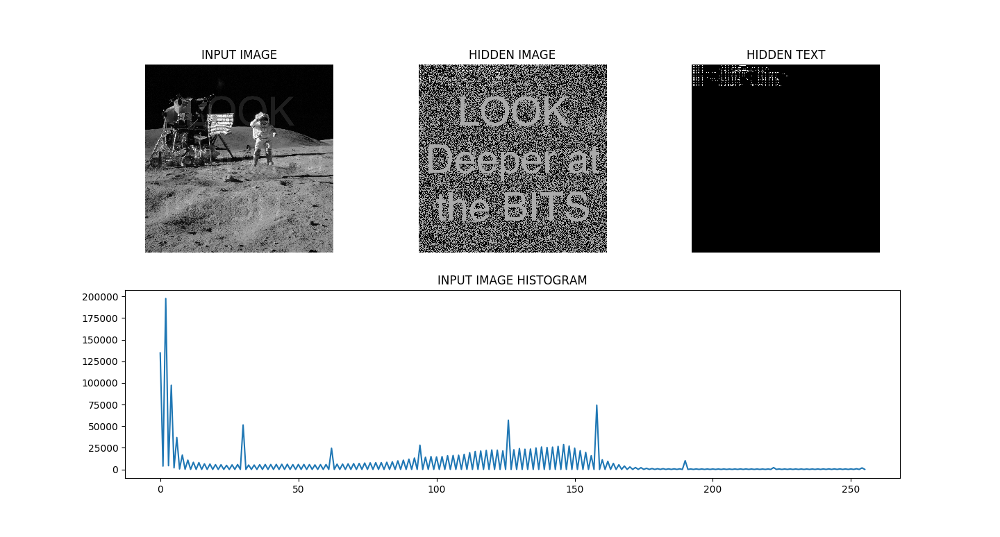

CHALLENGE ACCEPTED
==================

Came across a code challenge online to solve a puzzle. 
Just could not resist. 

Credits: Nolan Van Heerden and the Garmin South Africa Team!  

USAGE
=====

Encode a hidden image and text

    python cli_chall_accepted.py \ 
        --encode ./data/nasa.bmp \
        --msg ./data/message.bmp \
        --bin ./data/homer.txt \
        --out ./data/merge.bmp 

Decode 

    python cli_chall_accepted.py 
        --decode ./data/merge.bmp

Python3 + package dependancies
    
    pip install -r requirements.txt

       
    
RESULTS
=======

Run below to generate the results

    ./test_encode.sh    
    ./test_decode.sh

NOTES
=====

Using OpenCV for some bonus points, since I wanted to relearn my past.

Caveats

- For encoding, i am sticking to the grayscale inputs. 
- Colour image inputs will be converted to grayscale.
- The args parsing in amature at best. 
- No stress/unit/cli testing done. 

REFERENCES
==========

https://docs.opencv.org/3.1.0/d1/db7/tutorial_py_histogram_begins.html
https://towardsdatascience.com/steganography-hiding-an-image-inside-another-77ca66b2acb1
https://images.nasa.gov/

Art sources 
https://www.asciiart.eu/space/astronauts
https://images-assets.nasa.gov/image/as16-113-18339/as16-113-18339~orig.jpg